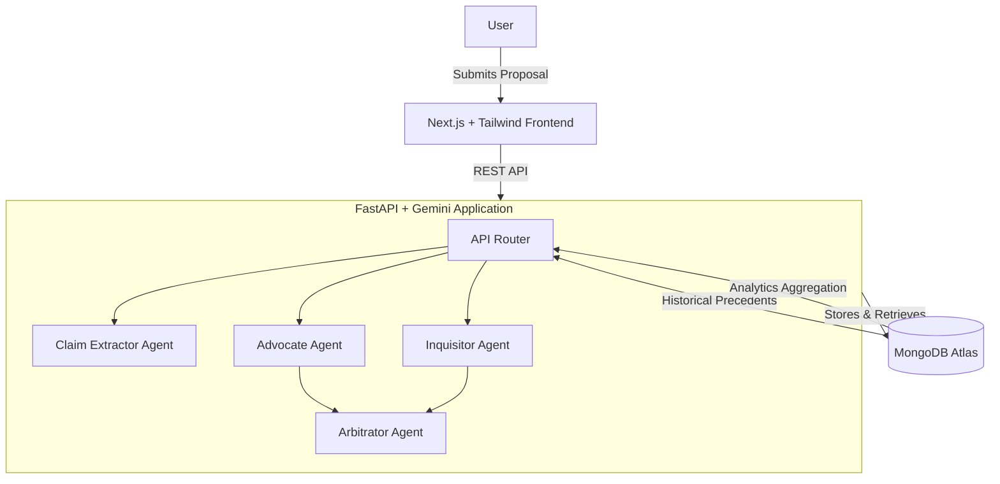
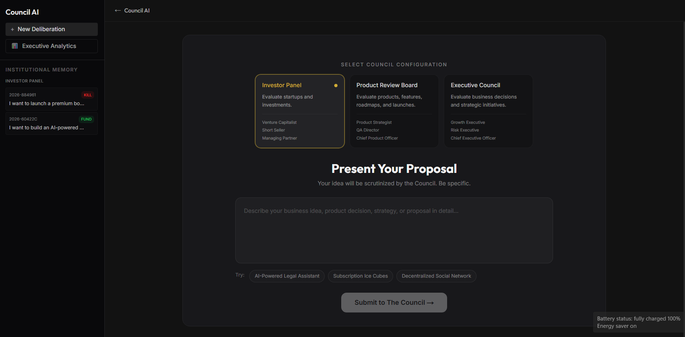
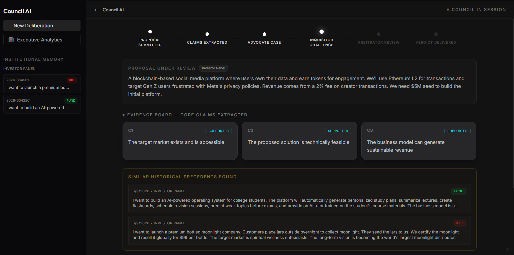
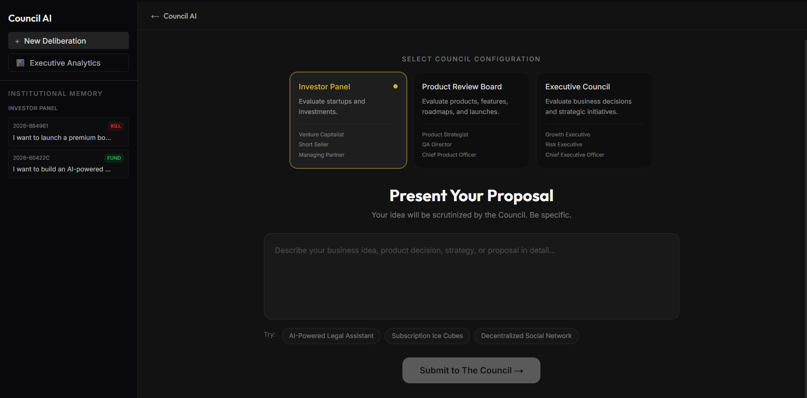
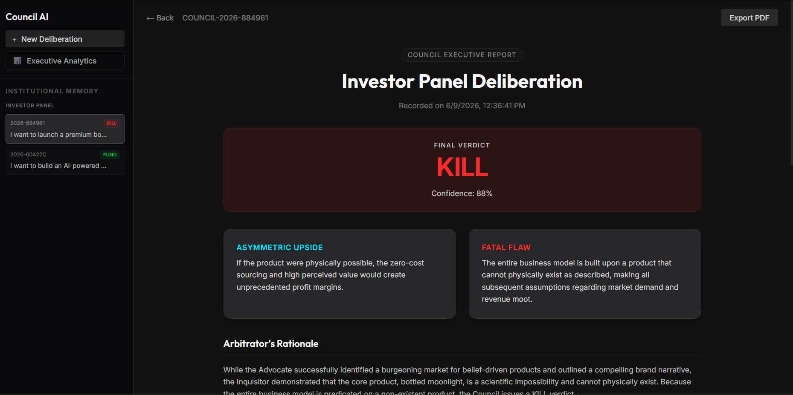
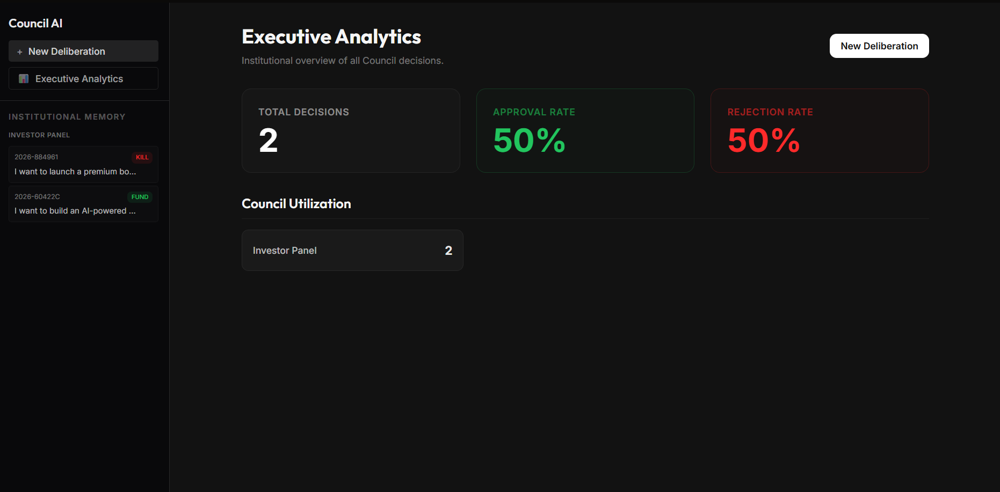

# ⚖️ Council AI
> **Don't Ask One AI. Ask the Council.**

[](https://cloud.google.com/)
[](https://www.mongodb.com/)
[](https://fastapi.tiangolo.com/)
[](https://nextjs.org/)
[](https://opensource.org/licenses/MIT)

Council AI transforms decision-making from a solitary, biased guess into a rigorous, multi-agent adversarial deliberation. By pitting specialized AI agents against each other—an **Advocate** to defend the proposal and an **Inquisitor** to tear it down—Council AI extracts the hidden fatal flaws and asymmetric upside of any idea before presenting the facts to the **Arbitrator** for a final, impartial verdict. 

Built for the **Google Cloud Rapid Agent Hackathon (MongoDB Track)**.

Council AI is a multi-agent decision intelligence platform that uses adversarial reasoning to stress-test ideas before action is taken.

Powered by Gemini and backed by MongoDB Atlas institutional memory, the platform transforms isolated AI conversations into persistent organizational intelligence.

## Demo Video

[Watch the 3-Minute Demo](REPLACE_WITH_LINK)

---

## 🛑 The Problem

Solo founders, startup teams, executives, and students face a constant battle against **Decision Paralysis** and **Confirmation Bias**. 

When using standard AI models (like ChatGPT or Gemini) to evaluate an idea, the AI acts as a sycophant—it agrees with the user, validates their assumptions, and rarely provides the harsh, critical pushback required to prevent catastrophic failures. You don't need a yes-man; you need a stress test.

## 💡 The Solution

Council AI solves the "sycophant problem" by implementing **Adversarial Deliberation**. 

Instead of asking one AI for its opinion, Council AI orchestrates a specialized panel:
1. **The Advocate:** A specialized Gemini agent that structurally defends the proposal, highlights the upside, and builds the strongest possible case.
2. **The Inquisitor:** A ruthless, adversarial Gemini agent mandated to identify the single weakest assumption in the proposal and systematically destroy it.
3. **The Arbitrator:** An impartial executive agent that evaluates the arguments, scores the confidence, and issues a final, binding verdict (FUND/KILL, APPROVE/REJECT).

*Structured disagreement produces superior outcomes.*

---

## How Gemini Powers the Council

Council AI transforms Gemini from a standard conversational assistant into a rigorous decision intelligence engine. The system leverages adversarial reasoning by assigning specific, conflicting objectives to specialized Gemini agents:

* **Claim Extractor Agent:** Analyzes unstructured proposals and distills them into core, falsifiable assumptions.
* **Advocate Agent:** Defends the proposal, highlighting its strengths and building the strongest possible case for the user's idea.
* **Inquisitor Agent:** A ruthless adversarial agent mandated to identify the single weakest assumption and systematically destroy it.
* **Arbitrator Agent:** An impartial executive agent that evaluates the arguments from both the Advocate and Inquisitor, scores confidence, and issues a final, binding verdict.

Each role is powered by a separate Gemini context, ensuring that the AI evaluates ideas from multiple angles simultaneously rather than defaulting to a single, biased response.

---

## ✨ Core Features

- **Multi-Agent Deliberation:** Observe agents debating in real-time.
- **Claim Extraction:** Automatically extracts core assumptions from unstructured proposals.
- **Adversarial Challenge System:** Real-time highlighting of which claims are successfully defended vs. destroyed.
- **Arbitration Engine:** Deterministic JSON verdicts with rationale and fatal flaw analysis.
- **Institutional Memory:** MongoDB-backed storage of all past deliberations.
- **Historical Precedent Retrieval:** Automatically retrieves similar past decisions to inform current deliberations.
- **Executive Analytics Dashboard:** Real-time visualizations of council verdicts, approval rates, and deliberation metrics.
- **PDF Report Export:** Generate professional, investor-ready executive summaries of any deliberation.
- **MongoDB-Powered Decision Intelligence:** Turns a chatbot into a persistent enterprise platform.

---

## 🏛️ Architecture



### 🛠️ Tech Stack
- **Frontend:** Next.js 14, React, Tailwind CSS, Framer Motion
- **Backend:** Python, FastAPI, Google Gemini SDK (Gemini 2.5 Flash), asyncio
- **Database:** MongoDB Atlas, Motor (Asyncio Driver)

---

## 🍃 MongoDB Integration

MongoDB is the core engine that elevates Council AI from a transient "chatbot toy" into a **Persistent Decision Intelligence Platform**. 

### Why MongoDB Matters

Without a database, AI interactions are ephemeral: decisions disappear, no organizational learning occurs, and no historical precedent exists.

Council AI uses MongoDB Atlas as a persistent institutional memory layer. We store:
* Proposals
* Extracted Claims
* Advocate arguments
* Inquisitor arguments
* Arbitrator verdicts
* Historical precedents

MongoDB transforms the platform from a temporary AI conversation into a continuously improving decision intelligence system.

**Why MongoDB is Critical:**
1. **Persistent Decision Storage:** Every claim, argument, and verdict is stored in highly flexible BSON documents, perfectly accommodating the dynamic length of AI text generation.
2. **Historical Precedents:** We query MongoDB to instantly retrieve past decisions, allowing the Arbitrator to maintain consistency across the organization's history.
3. **Institutional Memory:** Companies lose knowledge when employees leave. MongoDB ensures every decision and its rationale is permanently recorded.
4. **Analytics Aggregations:** We utilize MongoDB Aggregation Pipelines to calculate real-time approval rates, confidence intervals, and agent performance.

---

## Product Walkthrough

### Dashboard & Institutional Memory

| Dashboard | Live Deliberation |
|:---:|:---:|
|  |  |
| *Executive workspace featuring council selection, proposal submission, and MongoDB-powered institutional memory.* | *Real-time adversarial reasoning between specialized AI council members before arbitration.* |

---

### Decision Intelligence Engine

| Preview Page | Historical Executive Reports |
|:---:|:---:|
|  |  |
| *Preview your ideas and pitch to a Panel that matters in a click* | *Persistent decision records stored in MongoDB Atlas and accessible as institutional memory.* |

---

### Executive Analytics

<p align="center">
  
</p>

<p align="center">
  <em>
    Real-time analytics generated from MongoDB institutional memory, including decision outcomes,
    council utilization, and organizational intelligence metrics.
  </em>
</p>

## 🚀 Installation & Local Development

### Prerequisites
- Node.js 18+
- Python 3.12+
- MongoDB Atlas Account
- Google Gemini API Key

### Backend Setup
```bash
cd backend
python -m venv venv
source venv/bin/activate  # On Windows: .\venv\Scripts\activate
pip install -r requirements.txt
```

### Frontend Setup
```bash
cd frontend
npm install
```

### Environment Variables
Create a `.env` file in the `backend` directory based on `.env.example`:
```env
GEMINI_API_KEY=your_gemini_api_key
GEMINI_MODEL=gemini-2.5-flash
MONGODB_URI=mongodb+srv://<user>:<password>@cluster.mongodb.net/?retryWrites=true&w=majority
MONGODB_DB_NAME=council_ai
```

### Running the Application
**Start Backend:**
```bash
cd backend
uvicorn main:app --reload
```

**Start Frontend:**
```bash
cd frontend
npm run dev
```

Navigate to `http://localhost:3000`.

---

## 🗺️ Future Roadmap

- **Atlas Vector Search:** Implement RAG using MongoDB Atlas Vector Search to allow agents to cite external documents, research papers, and company wikis during deliberations.
- **Voyage AI Embeddings:** Integrate state-of-the-art embedding models to drastically improve historical precedent matching accuracy.
- **Organizational Memory:** Enable teams to upvote/downvote Arbitrator verdicts, training the system on company culture over time.
- **Decision Outcome Tracking:** Allow users to update past decisions 6 months later with "What actually happened," allowing the Arbitrator to calibrate its accuracy.
- **Team Councils:** Multiplayer mode where human users can step in and take over the role of Advocate or Inquisitor.

---

<p align="center">Built for the Google Cloud Rapid Agent Hackathon — MongoDB Track.</p>
